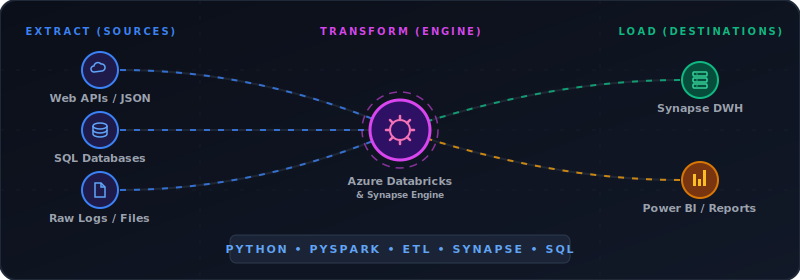

<h1 align="center">Hi 👋, I'm Kundan Singh</h1>
<h3 align="center">Lead Data Engineer | AI Data Platform Architect</h3>

  

  

---

### 👨‍💻 About Me
- 🔭 I’m currently working as a **Lead Data Engineer** at **Pella Corporation**
- ☁️ I specialize in **Azure Synapse, Databricks (Unity Catalog), and PySpark**
- 🧠 Actively building and exploring **Retrieval-Augmented Generation (RAG) pipelines** and **Vector Databases (ChromaDB)**
- 🏅 **Databricks Partner Certified** in Data & AI Governance and EDW Migrations
- 📝 Check out my [Live Web Resume](https://ksrawat95.github.io/resume/)
- 📫 How to reach me: [LinkedIn](https://www.linkedin.com/in/kundansingh95/)

---

### 🛠️ Tech Stack & Tools

  
    
  <!-- Data Engineering Specific Badges -->
  
  
  
  
  

---

### 🚀 Live Hosted Demos (GitHub Pages)
A collection of my interactive frontend data visualizations and logic projects:
* 🌐 **[AI Data Engineering Portfolio](https://ksrawat95.github.io/ai-data-engineering-portfolio/)**
* 🌐 **[Sorting Simulator](https://ksrawat95.github.io/sorting-simulator/)**
* 🌐 **[Multicolor Line Chart (D3.js)](https://ksrawat95.github.io/multicolor-line-chart-d3/)**
* 🌐 **[Animated Barchart Tooltip](https://ksrawat95.github.io/animated-barchart-tooltip/)**

---

### 📊 GitHub Stats

  
  

---

  <i>"Transforming raw data into actionable intelligence and scalable AI systems."</i>

